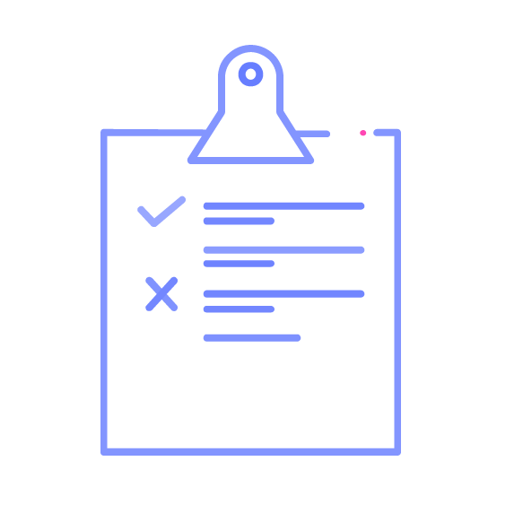
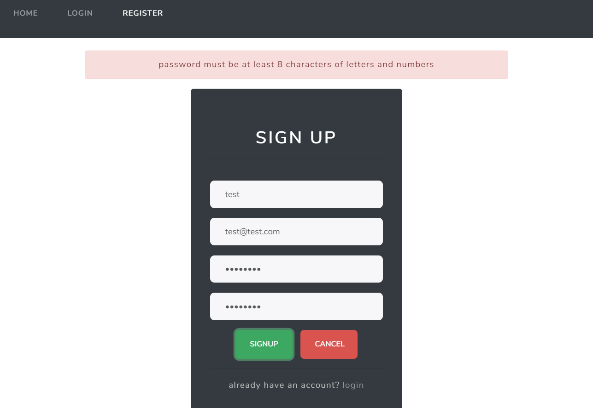
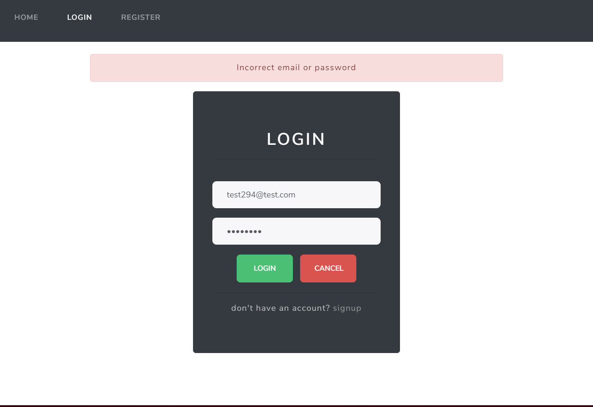
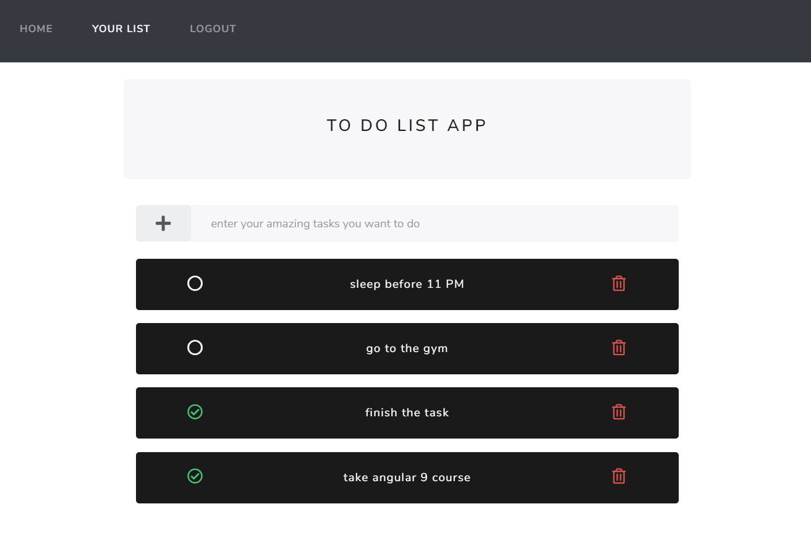

# ToDoApp-MEANStack

A simple to do list application with accounts and authentication to store a to-do list for each user using MEAN stack technologies.

## Tools used

- Server: [NodeJs](https://nodejs.org/en/download/) with [Express](https://expressjs.com/) as framework.
- frontend: [Angular](https://angular.io/)
- database: [mongoDB](https://www.mongodb.com/).
- Function documentation: [jsdoc](https://jsdoc.app/).
- API documentation: [postman](https://documenter.getpostman.com/view/10629897/SzzoZFE8)
- Code Style: [airbnb](https://github.com/airbnb/javascript)

## Getting Started

These instructions will get you a copy of the project up and running on your local machine for development and testing purposes.

## Prerequisites

### Back-end

- you need to clone the project, then open a terminal in the root directory and write the following command:

      npm i

- then you will need a file called `.env` without a name only an extension to exist in the root directory the file `example.env` has the kind of variables you need to have.

- for running the project you can `npm i -g nodemon` then type `nodemon` it will run the project and refresh at any change of code on saving.

### Front-end

- This project was generated with [Angular CLI](https://github.com/angular/angular-cli) version 9.1.9.

- building: navigate to `./angular-src` then Run `ng build` to build the project. The build artifacts will be stored in the `./public` directory. Use the `--prod` flag for a production build.

### API documentation

- postman documentation was used for this project, you can find the post man collection in the root of the repo in json format you can import it in postman application. you can find the documentation [here](https://documenter.getpostman.com/view/10629897/SzzoZFE8).

## screenshots

## Author

- [Muhammad Ahmad Hesham](https://github.com/Etshawy1)

## License

- Licensed under the [MIT License](./License).

## External links

you can find a heroku deployed version of the project in the following [link](https://task-organizer-mean.herokuapp.com/).
